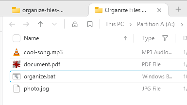
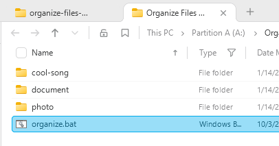

# Organize Files by Name

A dead-simple Windows batch script that moves every file in the current folder  
into its own subfolder named after the file (without extension).

### Before

photo.jpg

document.pdf

cool-song.mp3

organize.bat

### After

photo/
photo.jpg

document/
document.pdf

cool-song/
cool-song.mp3

organize.bat           ← script stays in place

## Usage

1. Download `organize.bat`
2. Put it in the folder you want to organize
3. Double-click it (or run from cmd)

Done! 🎉

## Features
- Skips itself (`organize.bat`)
- One folder per file
- No confirmation prompts
- Works on Windows (any version that supports batch)

## Limitations / Warnings
- Won't work if a folder with the same name already exists
- Doesn't handle files with the same name but different extensions well
- No undo (be careful!)
- Only moves files (folders are ignored)

## License

[MIT License](LICENSE) — feel free to use, modify, distribute however you want.

Made with ❤️ for people drowning in messy Downloads folders

